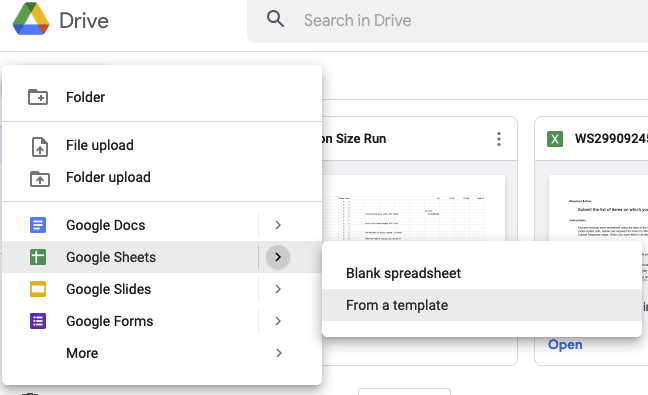
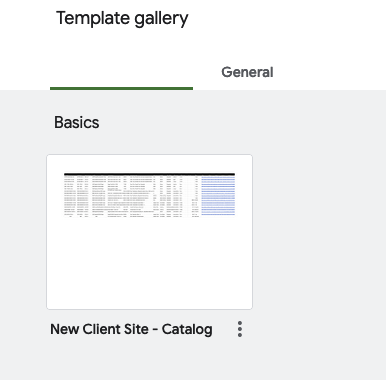
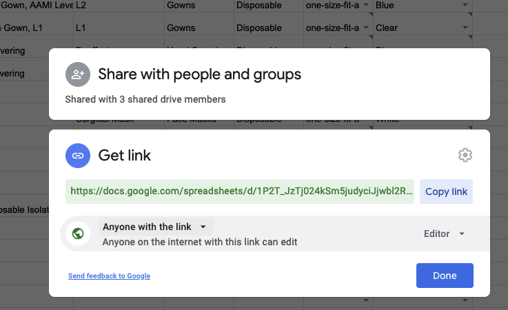

# SSSP Catalog Build Process
### Creating a new sheet

*  1. Navigate to `Drive > Shared Drives > SSSP-Compnay-Info > Suppliers > Inventory` 
*  2.  Create new sheet from a template  

* 	3. Add Products to the `Data Entry` tab.
	
* 	4. Navigate to `Share` button inside of the new file
    * 	Select `Get Link` and change options to `Anyone with the link` or to `Anyone in your Organization` 
* 	5. Copy link and Embed into Clickup. 

